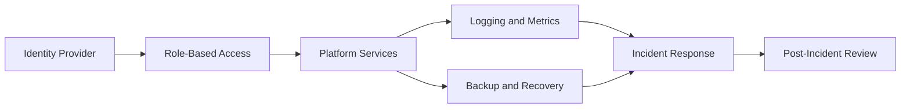

Secure platform operations depend on a repeatable baseline that connects identity, network controls, observability, backup, and incident response. The baseline should be understandable to operators who did not build the platform.

## Business Context

Enterprise platform teams need a shared operating model for infrastructure changes, incident response, and recovery. Without a baseline, teams may rely on tribal knowledge during the exact moments when decisions need to be consistent and auditable.

<Callout type="important" title="Architecture constraint">
  The baseline should define minimum operating controls without preventing teams from adding
  stricter controls for regulated or business-critical environments.
</Callout>

## Requirements Trace

<DataTable caption="Operations baseline requirements">
  <table>
    <thead>
      <tr>
        <th scope="col">Requirement</th>
        <th scope="col">Architecture response</th>
        <th scope="col">Validation signal</th>
      </tr>
    </thead>
    <tbody>
      <tr>
        <td>Operational ownership</td>
        <td>Document platform, network, storage, and security team boundaries.</td>
        <td>Escalation paths are linked from runbooks.</td>
      </tr>
      <tr>
        <td>Auditability</td>
        <td>Centralize identity, logging, and change records.</td>
        <td>Security review can trace administrative activity.</td>
      </tr>
      <tr>
        <td>Recovery readiness</td>
        <td>Define backup scope, restore order, and recovery owners.</td>
        <td>Restore tests are recorded and reviewed.</td>
      </tr>
    </tbody>
  </table>
</DataTable>

## Baseline Flow



## Operational Controls

The baseline should define required controls for access, network exposure, monitoring, backup, and change management. These controls do not need to be complex, but they must be visible and testable.

```yaml
controls:
  access:
    owner: security
    review: quarterly
  backup:
    owner: platform-operations
    restore-test: scheduled
  observability:
    owner: platform-engineering
    retention: documented
```

## Review Cadence

Review the baseline after major platform changes, recovery tests, and security incidents. The architecture guide should remain current enough that operators can use it as a first reference during escalation.
