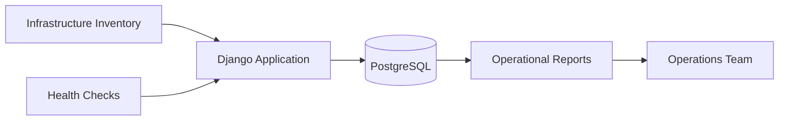

## Architecture Diagram

## Project Overview

This project organizes infrastructure health, inventory, and reporting data through a Django application. The goal is to give operations teams a reliable place to inspect platform state and prepare repeatable reporting workflows.

## Implementation Details

The application model separates inventory records, health observations, and report views. Django provides a maintainable structure for operational workflows while PostgreSQL stores the historical state needed for reporting.

<Callout type="tip" title="Design note">
  Monitoring applications stay useful when the data model reflects operator questions rather than
  only raw collection output.
</Callout>

## Challenges

- Keeping health checks actionable instead of turning the tool into a generic dashboard.
- Modeling infrastructure inventory in a way that supports future automation.
- Separating reporting needs from real-time alerting responsibilities.

## Lessons Learned

- Inventory quality determines the usefulness of operational reporting.
- Health checks need ownership and remediation context.
- A small internal tool can reduce repeated manual reporting work when the workflow is clear.
