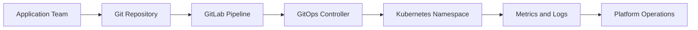

## Architecture Diagram

## Project Overview

This project defines a shared Kubernetes platform model for application delivery teams. The work focuses on stable cluster operations, clear tenant boundaries, and repeatable deployment workflows rather than one-off cluster provisioning.

## Implementation Details

The implementation centers on namespace standards, GitOps-based promotion, baseline observability, and support handoff. Platform conventions are documented so application teams can onboard without relying on undocumented operational knowledge.

<Callout type="important" title="Project focus">
  The platform is treated as an operating model, not only as a cluster build. Documentation,
  ownership, and recovery expectations are part of the implementation.
</Callout>

## Challenges

- Balancing shared platform controls with team-level delivery autonomy.
- Keeping cluster standards simple enough for repeated adoption.
- Making operational ownership visible across platform, security, and application teams.

## Lessons Learned

- Tenant onboarding is easier when namespace conventions are documented before teams request access.
- GitOps workflows need clear promotion rules, not only repository templates.
- Platform documentation should be reviewed alongside technical readiness checks.
