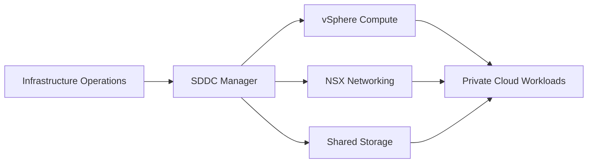

## Architecture Diagram

## Project Overview

This project documents a private cloud foundation using VMware Cloud Foundation for standardized datacenter operations. The work emphasizes lifecycle management, platform consistency, and clear operational boundaries across compute, networking, and storage.

## Implementation Details

The implementation model aligns SDDC Manager, vSphere, NSX, identity integration, and operational handoff. The project treats lifecycle management and day-two operations as first-class design concerns.

<Callout type="note" title="Operations note">
  Private cloud implementation is incomplete until lifecycle operations, ownership, and recovery
  expectations are documented for the teams that will operate the platform.
</Callout>

## Challenges

- Coordinating compute, network, storage, and identity dependencies.
- Preserving lifecycle consistency while accommodating datacenter constraints.
- Documenting the support model in a way that survives handoff.

## Lessons Learned

- Lifecycle management should influence the initial platform design.
- Cross-domain ownership needs explicit escalation paths.
- Datacenter projects benefit from documentation that connects architecture to operations.
