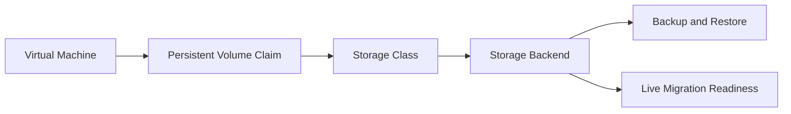

## Why It Matters

Virtual machines make storage assumptions visible. A class that works for stateless containers may not meet the latency, access mode, migration, or backup expectations of stateful VM workloads.

## How to Use This Resource

Use this reference before publishing shared VM templates. Confirm the storage class behavior with representative boot, migration, snapshot, and restore workflows.

## Planning Questions

- Which VM profiles need predictable latency?
- Which classes support snapshot and restore workflows?
- Which workloads need live migration?
- Who owns capacity, backup, and recovery validation?

## Related Practice

Use this resource with the OpenShift Virtualization storage article and Dell PowerFlex project record. The resource keeps planning questions visible while the linked assets provide implementation context.
