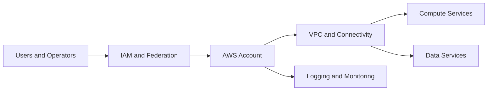

## Overview

AWS provides cloud infrastructure and managed services for compute, storage, networking, identity, databases, and operations. PTKP uses this page to connect cloud architecture knowledge with certification and platform engineering context.

## Key Concepts

- Accounts and organizations define administrative and billing boundaries.
- IAM policies, roles, and federation control access.
- VPC design shapes network isolation, routing, and connectivity.
- Managed services reduce operational burden when ownership and limits are understood.

## Architecture Overview



## Installation

AWS usage begins with account access, CLI or SDK setup, region selection, and identity configuration. Validate credentials and account boundaries before running infrastructure automation.

```bash
aws sts get-caller-identity
aws configure list
```

## Configuration

Configuration should define account ownership, region policy, IAM boundaries, network standards, tagging, logging, and backup requirements. These guardrails are more important than any individual service setting.

## Best Practices

- Prefer federated access and least-privilege roles.
- Keep network, identity, and logging standards consistent across accounts.
- Use infrastructure automation for repeatable service configuration.
- Review service quotas and regional dependencies during architecture design.

## Common Issues

- Permission troubleshooting becomes slow when IAM ownership is unclear.
- Network reachability fails when route tables, security groups, and DNS are reviewed separately.
- Cost and operational risk increase when tagging and ownership are not enforced.

## References

- [AWS documentation](https://docs.aws.amazon.com/)
