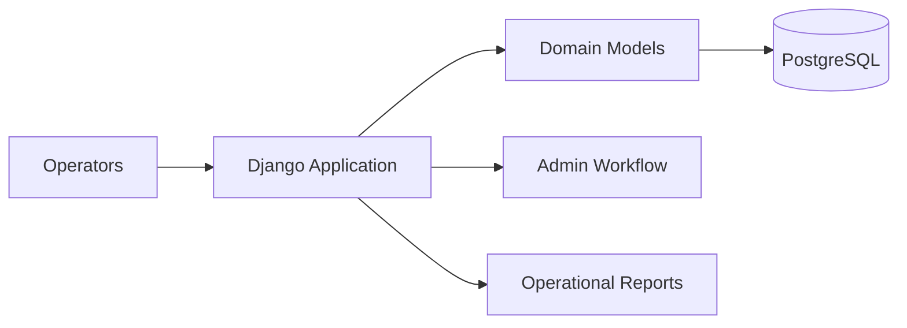

## Overview

Django provides a structured Python framework for operational applications, inventory systems, and reporting workflows. In PTKP it is tied to infrastructure monitoring and internal tool design.

## Key Concepts

- Models define the application data structure.
- Views and templates expose workflows to operators.
- Admin interfaces support controlled data review and maintenance.
- Migrations keep database changes reviewable.

## Architecture Overview



## Installation

Install Django inside a project virtual environment and pin dependencies through the selected packaging workflow.

```bash
python -m venv .venv
python -m pip install django
python manage.py check
```

## Configuration

Configuration should separate settings by environment, keep secrets out of source control, define database connections explicitly, and document operational settings such as allowed hosts, static files, and logging.

## Best Practices

- Model operational concepts before building views.
- Keep business logic out of templates.
- Use migrations as reviewed infrastructure for application data.
- Document admin responsibilities when non-developers maintain records.

## Common Issues

- Applications become hard to operate when settings are copied between environments.
- Admin workflows can expose too much control when permissions are not reviewed.
- Reporting views lose credibility when the underlying inventory model is incomplete.

## References

- [Django documentation](https://docs.djangoproject.com/)
- [Django Infrastructure Monitoring System](/projects/django-infrastructure-monitoring-system/)
