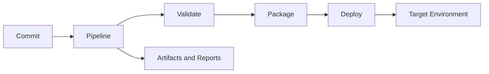

## Overview

GitLab CI/CD provides the pipeline layer for repeatable delivery workflows. In PTKP it is used to connect source control, validation, approvals, environment promotion, and infrastructure automation.

## Key Concepts

- Pipelines define ordered validation and delivery stages.
- Jobs run in controlled runner environments.
- Artifacts and reports preserve evidence from validation.
- Protected branches and environments support approval boundaries.

## Architecture Overview



## Installation

GitLab CI/CD behavior depends on the GitLab instance, runner registration, executor type, and base images. Validate runner access, secrets handling, cache behavior, and network reachability before using a pipeline for infrastructure changes.

```yaml
stages:
  - validate
  - plan
  - deploy
```

## Configuration

Configuration belongs in `.gitlab-ci.yml`, included templates, project variables, protected environment rules, and runner settings. Keep secrets outside the repository and make deployment approvals visible.

## Best Practices

- Keep validation fast and required for merge requests.
- Use protected variables and environments for sensitive deployments.
- Store reusable pipeline patterns in templates rather than duplicating full files.
- Capture plan, test, and deployment evidence as artifacts.

## Common Issues

- Pipelines become unreliable when runner images change without review.
- Deployment approvals lose value when protected environments are not enforced.
- Shared templates become difficult to maintain when project-specific exceptions are hidden.

## References

- [GitLab CI/CD documentation](https://docs.gitlab.com/ee/ci/)
- [GitLab CI/CD Platform](/projects/gitlab-cicd-platform/)
