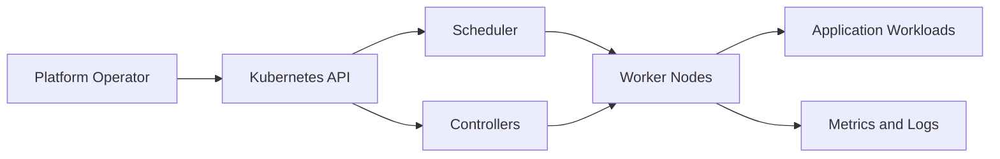

## Overview

Kubernetes provides the scheduling, service discovery, workload API, and reconciliation model for container platforms. In PTKP it acts as a hub for enterprise cluster design, OpenShift operations, troubleshooting notes, and certification records.

## Key Concepts

- API resources describe desired state for workloads, services, storage, and policy.
- Controllers reconcile desired state against actual cluster state.
- Nodes provide compute capacity while the control plane maintains cluster coordination.
- Namespaces, labels, and RBAC make ownership and access boundaries visible.

## Architecture Overview



## Installation

Installation should follow the supported distribution and operating model for the environment. Validate the control plane, networking, storage classes, ingress, identity integration, and backup posture before allowing shared workload onboarding.

```bash
kubectl version
kubectl get nodes -o wide
kubectl get storageclass
```

## Configuration

<DataTable caption="Kubernetes configuration areas">
  <table>
    <thead>
      <tr>
        <th scope="col">Area</th>
        <th scope="col">Purpose</th>
        <th scope="col">Validation signal</th>
      </tr>
    </thead>
    <tbody>
      <tr>
        <td>RBAC</td>
        <td>Limits administrative and workload access.</td>
        <td>Role bindings map to documented teams.</td>
      </tr>
      <tr>
        <td>Storage classes</td>
        <td>Expose supported persistence behavior.</td>
        <td>Access modes and backup expectations are documented.</td>
      </tr>
      <tr>
        <td>Network policy</td>
        <td>Controls workload communication paths.</td>
        <td>Default namespace behavior is tested.</td>
      </tr>
    </tbody>
  </table>
</DataTable>

## Best Practices

- Keep cluster ownership, upgrade responsibility, and break-glass access documented.
- Separate infrastructure services from tenant workloads where practical.
- Treat storage, ingress, observability, and backup as platform services, not afterthoughts.
- Test restore and node recovery workflows before production incidents.

## Common Issues

- Nodes report pressure conditions because capacity, eviction thresholds, or image cleanup are not controlled.
- Workloads fail scheduling when taints, tolerations, or resource requests do not match the node model.
- Troubleshooting slows down when namespace ownership and alert routing are unclear.

## References

- [Kubernetes documentation](https://kubernetes.io/docs/)
- [Kubernetes Node Health Checks](/lab-notes/kubernetes-node-health-checks/)
- [Enterprise Kubernetes Platform Architecture](/articles/enterprise-kubernetes-platform-architecture/)
