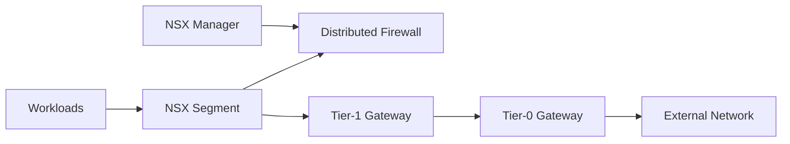

## Overview

NSX provides software-defined networking and security controls for virtualized and private cloud platforms. PTKP connects NSX to VMware Cloud Foundation, network operations, segmentation, and platform security.

## Key Concepts

- Segments provide logical network boundaries for workloads.
- Tiered routing separates tenant and provider routing responsibilities.
- Distributed firewall policy supports workload-level segmentation.
- Edge nodes connect overlay networks with physical or external networks.

## Architecture Overview



## Installation

Installation should follow the private cloud design for management appliances, transport nodes, uplinks, routing, DNS, NTP, certificates, and backup. Validate underlay reachability before relying on overlay networking.

```bash
ping -n 4 nsx-manager.example.internal
nslookup nsx-manager.example.internal
```

## Configuration

Configuration should document transport zones, uplink profiles, edge clusters, routing ownership, firewall policy ownership, backup, and monitoring. Network changes should remain traceable because they affect many platform dependencies.

## Best Practices

- Keep firewall policy ownership and review cadence explicit.
- Validate underlay MTU and routing before troubleshooting overlays.
- Separate edge capacity planning from workload cluster capacity planning.
- Document north-south and east-west traffic paths.

## Common Issues

- Overlay connectivity fails when underlay MTU, routing, or transport node health is not validated.
- Firewall policy becomes difficult to audit when rules do not map to workload ownership.
- Edge capacity issues appear when routing, NAT, and load-balancing assumptions are not documented.

## References

- [VMware technical documentation](https://techdocs.broadcom.com/)
- [VMware Cloud Foundation Datacenter](/projects/vmware-cloud-foundation-datacenter/)
