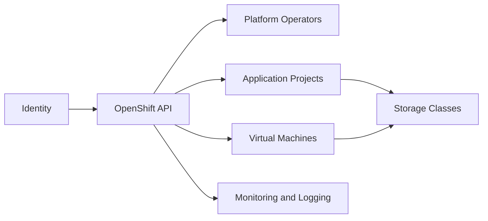

## Overview

OpenShift is the enterprise Kubernetes platform used in PTKP for application delivery, cluster operations, and virtualization scenarios. The page collects related architecture notes, project records, and storage planning references.

## Key Concepts

- Operators package lifecycle management for platform and workload services.
- Projects and security context constraints shape workload isolation.
- Routes, image streams, and build workflows support application delivery.
- OpenShift Virtualization adds virtual machine operations on top of Kubernetes primitives.

## Architecture Overview



## Installation

Installation should be planned around the supported infrastructure provider, network design, storage backend, identity provider, and lifecycle management process. Validate these inputs before onboarding application or virtual machine workloads.

```bash
oc get clusterversion
oc get nodes
oc get co
```

## Configuration

Configuration work usually centers on identity, image registry behavior, ingress certificates, storage classes, monitoring retention, backup scope, and role boundaries between platform and application teams.

## Best Practices

- Keep cluster operators healthy before changing workload-facing services.
- Document default storage classes separately for container and VM workloads.
- Treat namespace templates, RBAC, quotas, and network policies as onboarding controls.
- Validate virtualization storage and migration behavior with representative virtual machines.

## Common Issues

- Operator degradation hides dependency problems in networking, storage, or certificates.
- Virtual machine workloads expose storage assumptions that normal container workloads do not.
- Platform teams lose clarity when project ownership and escalation paths are not recorded.

## References

- [OpenShift product documentation](https://docs.openshift.com/)
- [OpenShift Virtualization Storage Planning](/articles/openshift-virtualization-storage-planning/)
- [Dell PowerFlex with OpenShift Virtualization](/projects/dell-powerflex-openshift-virtualization/)
