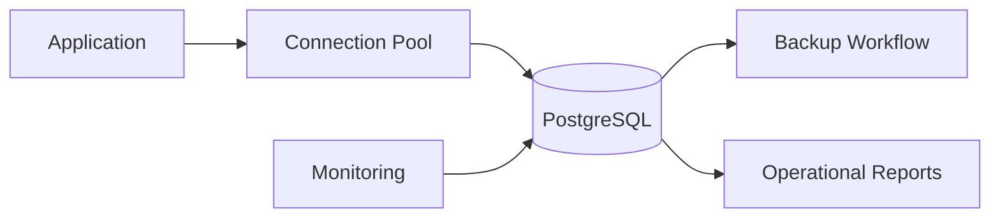

## Overview

PostgreSQL is used for reliable relational data storage and operational reporting. PTKP connects it to Django application work, data model design, backup posture, and database ownership.

## Key Concepts

- Schemas, tables, indexes, and constraints define data integrity.
- Transactions protect consistency during application workflows.
- Roles and grants control database access.
- Backups and restore tests prove operational readiness.

## Architecture Overview



## Installation

PostgreSQL should be installed through the approved platform package, managed service, or container workflow. Validate client connectivity and authentication before application rollout.

```bash
psql --version
psql "$DATABASE_URL" -c "select current_database();"
```

## Configuration

Configuration should document database ownership, connection limits, backup schedule, retention, role boundaries, extension policy, and monitoring checks. Application migrations should be reviewed with the same care as infrastructure changes.

## Best Practices

- Enforce least-privilege database roles.
- Review indexes against real query patterns.
- Test restore procedures, not only backup jobs.
- Track schema migrations as part of application deployment.

## Common Issues

- Applications fail under load when connection count and pooling are not planned.
- Reporting queries become risky when indexes and data growth are not reviewed.
- Recovery plans remain unproven when backups are never restored in a test path.

## References

- [PostgreSQL documentation](https://www.postgresql.org/docs/)
- [Django Infrastructure Monitoring System](/projects/django-infrastructure-monitoring-system/)
