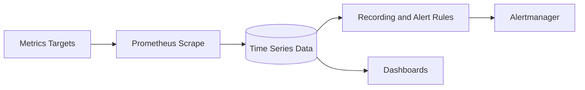

## Overview

Prometheus provides metrics collection and alerting signals for infrastructure, Kubernetes, and application platforms. PTKP treats it as part of the operations baseline rather than a standalone dashboard tool.

## Key Concepts

- Targets expose metrics through scrape endpoints.
- Time series data is queried with PromQL.
- Alerting rules translate symptoms into actionable signals.
- Labels provide the dimensions needed for ownership and triage.

## Architecture Overview



## Installation

Installation should follow the platform distribution, operator, or package model already used by the environment. Validate scrape reachability, retention, alert routing, and storage before relying on alerts.

```bash
promtool check rules alerts.yml
```

## Configuration

Configuration should define scrape targets, retention, service discovery, alert routing, ownership labels, and rule review procedures. Alerts should identify who owns the response and what the first diagnostic step should be.

## Best Practices

- Prefer alerts that require action.
- Label metrics so ownership and service boundaries are visible.
- Review cardinality before adding high-volume labels.
- Keep runbook links close to alert definitions.

## Common Issues

- Alert fatigue appears when symptoms are noisy or unactionable.
- Query performance suffers when labels create excessive cardinality.
- Incident response slows when alerts do not identify service ownership.

## References

- [Prometheus documentation](https://prometheus.io/docs/)
- [Secure Platform Operations Baseline](/architecture/secure-platform-operations-baseline/)
