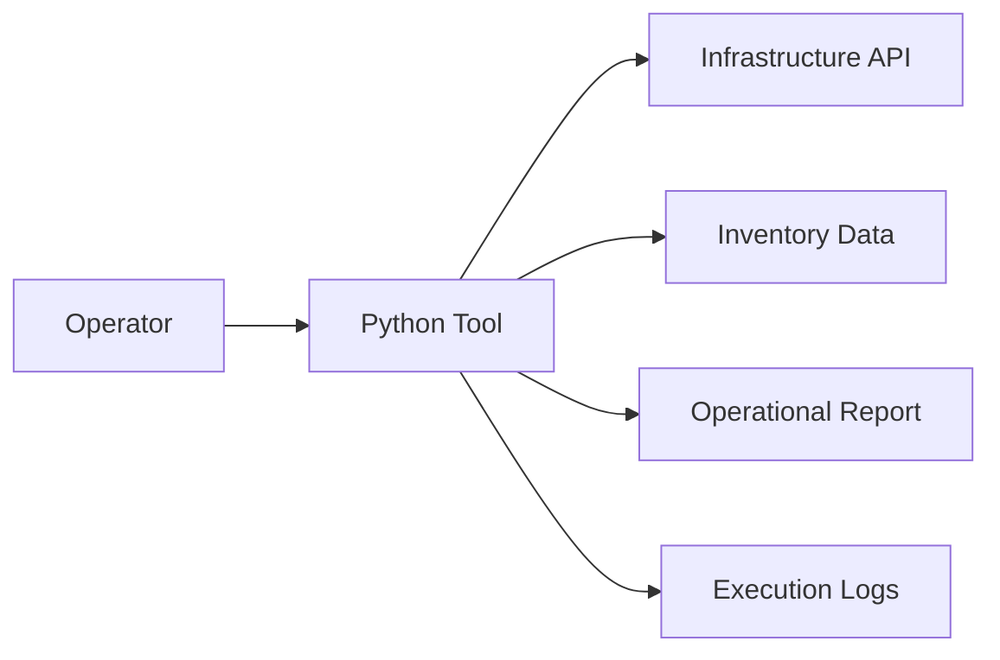

## Overview

Python is used for automation, integration tooling, reporting, and internal systems. PTKP references Python most often through Django application work and operational scripts that need to remain readable.

## Key Concepts

- Virtual environments isolate dependencies per project.
- Packages and lockfiles make runtime behavior reproducible.
- Type hints improve maintainability for shared tooling.
- Standard library modules often solve operational scripting needs without extra dependencies.

## Architecture Overview



## Installation

Install Python through the approved operating system or runtime image. Create a virtual environment before adding project dependencies.

```bash
python --version
python -m venv .venv
python -m pip install --upgrade pip
```

## Configuration

Configuration should separate code from environment-specific values. Use environment variables, typed settings modules, or deployment configuration rather than hardcoding credentials or platform URLs.

## Best Practices

- Keep scripts small and explicit.
- Add type hints where the tool crosses module boundaries.
- Prefer standard library modules unless a dependency has clear value.
- Log actions and failures in a way operators can use during troubleshooting.

## Common Issues

- Automation becomes fragile when local workstation assumptions leak into shared tools.
- Dependency conflicts appear when virtual environments are not used consistently.
- Error handling is less useful when scripts print raw exceptions without operational context.

## References

- [Python documentation](https://docs.python.org/3/)
- [Django Infrastructure Monitoring System](/projects/django-infrastructure-monitoring-system/)
