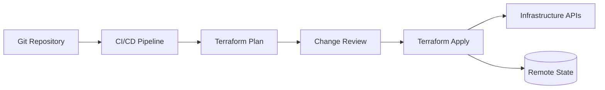

## Overview

Terraform provides a declarative workflow for infrastructure provisioning and controlled change. In PTKP it connects CI/CD project notes, infrastructure automation patterns, and environment promotion practices.

## Key Concepts

- Providers expose infrastructure APIs as declarative resources.
- State records the known infrastructure model and must be protected.
- Modules package reusable infrastructure patterns.
- Plans make proposed changes reviewable before apply.

## Architecture Overview



## Installation

Install Terraform through the approved workstation, runner, or build image process. Keep provider versions pinned and validate the CLI version used by pipelines before applying shared infrastructure changes.

```bash
terraform fmt -check
terraform init
terraform plan
```

## Configuration

Configuration should define provider constraints, backend settings, module inputs, environment variables, and naming standards. Remote state and credentials should be configured by the platform workflow rather than copied between operators.

## Best Practices

- Review plans in CI/CD before approving changes.
- Keep modules small enough to understand and test.
- Protect state with remote locking and least-privilege access.
- Separate environment inputs from reusable module logic.

## Common Issues

- Drift appears when manual infrastructure changes bypass Terraform.
- State files become risky when ownership and backend access are unclear.
- Modules become hard to reuse when they mix provider setup, naming policy, and environment-specific assumptions.

## References

- [Terraform documentation](https://developer.hashicorp.com/terraform/docs)
- [GitLab CI/CD Platform](/projects/gitlab-cicd-platform/)
