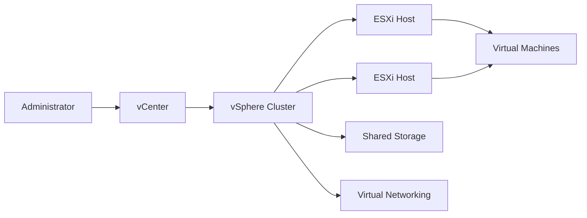

## Overview

VMware vSphere provides the virtualization layer for enterprise compute clusters and virtual machine operations. PTKP connects vSphere to private cloud design, capacity management, and operational ownership.

## Key Concepts

- Clusters group ESXi hosts for resource scheduling and availability.
- vCenter provides inventory, lifecycle, permissions, and operational control.
- DRS and HA influence workload placement and recovery behavior.
- Datastores and networks define the practical limits for virtual machine design.

## Architecture Overview



## Installation

Installation should follow the datacenter design for host firmware, management networking, storage presentation, DNS, NTP, and certificate requirements. Validate host readiness before adding capacity to shared clusters.

```bash
nslookup vcenter.example.internal
ping -n 4 esxi-01.example.internal
```

## Configuration

Configuration should define cluster admission control, resource pools, datastore usage, network standards, host profiles, permissions, backup scope, and monitoring. These decisions should be documented before virtual machines rely on the cluster.

## Best Practices

- Keep management access and role assignments reviewed.
- Align cluster capacity planning with recovery requirements.
- Document datastore and network placement rules for workload teams.
- Monitor host health, resource pressure, and vCenter service status.

## Common Issues

- Capacity incidents occur when reservations, limits, and growth trends are not reviewed together.
- VM recovery expectations are unclear when HA and backup responsibilities are separate.
- Operations become inconsistent when host configuration drifts between cluster members.

## References

- [VMware technical documentation](https://techdocs.broadcom.com/)
- [VMware Cloud Foundation Datacenter](/projects/vmware-cloud-foundation-datacenter/)
