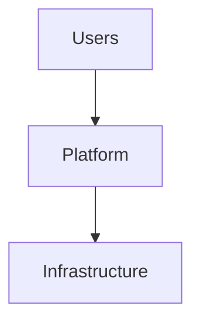

# Executive Summary

Provide a concise overview of the architecture.

---

# Business Requirements

Describe the business objectives.

---

# Technical Requirements

List all technical requirements.

- Requirement 1
- Requirement 2
- Requirement 3

---

# Assumptions

List all architectural assumptions.

---

# Constraints

Describe known constraints.

---

# High-Level Architecture

---

# Architecture Components

| Component | Purpose |
|----------|---------|
| | |

---

# Data Flow

Explain how data moves through the architecture.

---

# Network Design

Describe:

- Networks
- VLANs
- Firewalls
- Load Balancers
- DNS
- Routing

---

# Security Design

Cover:

- Authentication
- Authorization
- Encryption
- Certificates
- Secrets
- RBAC
- Network Security

---

# High Availability

Describe:

- Redundancy
- Failover
- Cluster Design
- Recovery

---

# Scalability

Explain horizontal and vertical scaling strategies.

---

# Monitoring

Describe:

- Metrics
- Logs
- Alerts
- Dashboards

---

# Backup and Recovery

Describe:

- Backup strategy
- Restore procedure
- Recovery objectives

---

# Deployment

Provide deployment steps.

---

# Validation

- [ ] Architecture validated
- [ ] Security validated
- [ ] Performance validated
- [ ] HA validated

---

# Operational Considerations

Document operational procedures.

---

# Risks

| Risk | Impact | Mitigation |
|------|--------|------------|
| | | |

---

# References

- Official documentation
- Vendor documentation
- RFCs

---

# Related Content

- Related Project
- Related Technology
- Related Article
