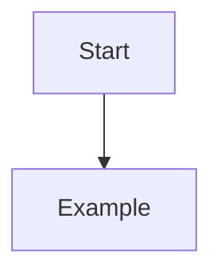

# Overview

Provide a concise summary of the topic.

---

# Why This Matters

Explain the practical value and business or engineering relevance.

---

# Prerequisites

- Requirement 1
- Requirement 2

---

# Background

Describe the concepts necessary to understand the topic.

---

# Architecture / Concept

Use Mermaid diagrams whenever appropriate.



---

# Implementation

Describe the implementation step by step.

## Step 1

Explanation.

```bash
# example
```

## Step 2

Explanation.

```yaml
# example
```

---

# Validation

Explain how to verify the implementation.

Checklist:

- [ ] Validation 1
- [ ] Validation 2
- [ ] Validation 3

---

# Troubleshooting

| Problem | Cause | Resolution |
|----------|-------|------------|
| | | |

---

# Best Practices

- Practice 1
- Practice 2
- Practice 3

---

# Security Considerations

Describe security implications and recommendations.

---

# Performance Considerations

Describe performance considerations and optimization techniques.

---

# References

- Official Documentation
- RFCs
- Vendor Documentation

---

# Related Content

- Related Article
- Related Project
- Related Technology
- Related Certification