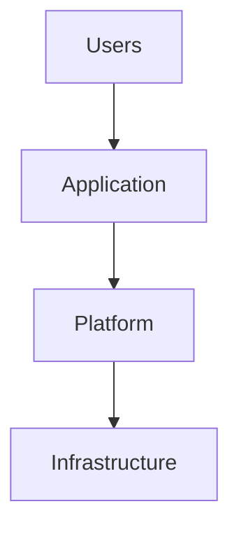

# Executive Summary

Provide a concise overview of the project.

---

# Business Objective

Describe the business problem and expected outcome.

---

# Technical Objective

Describe the technical goals.

---

# Project Scope

## In Scope

- Item 1
- Item 2

## Out of Scope

- Item 1
- Item 2

---

# Environment

| Component | Details |
|-----------|---------|
| Platform | |
| Infrastructure | |
| Virtualization | |
| Storage | |
| Networking | |

---

# Solution Architecture

---

# Technology Stack

| Technology | Purpose |
|------------|---------|
| | |

---

# Design Decisions

| Decision | Rationale |
|----------|-----------|
| | |

---

# Implementation

## Phase 1

Describe the implementation.

## Phase 2

Describe the implementation.

## Phase 3

Describe the implementation.

---

# Validation

- [ ] Functional validation completed
- [ ] Performance validated
- [ ] Security validated
- [ ] Disaster recovery validated

---

# Challenges

| Challenge | Resolution |
|-----------|------------|
| | |

---

# Lessons Learned

- Lesson 1
- Lesson 2
- Lesson 3

---

# Best Practices

- Practice 1
- Practice 2
- Practice 3

---

# Operational Considerations

Describe operational procedures.

---

# Future Improvements

- Improvement 1
- Improvement 2

---

# References

- Vendor documentation
- Internal design documents
- Official documentation

---

# Related Content

- Related Architecture Guide
- Related Technology
- Related Article
- Related Certification