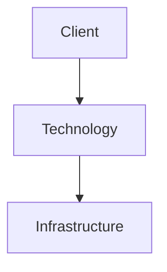

# Overview

Provide a concise introduction to the technology.

---

# Why This Technology

Explain:

- Primary purpose
- Business value
- Engineering value
- Common use cases

---

# Core Concepts

Describe the major concepts required to understand this technology.

---

# Architecture



---

# Components

| Component | Purpose |
|----------|---------|
| | |

---

# Installation

## Prerequisites

- Requirement 1
- Requirement 2

## Installation Steps

```bash
# commands
```

---

# Configuration

Describe the recommended configuration.

```yaml
# example
```

---

# Common Operations

Describe routine administrative tasks.

---

# Security Considerations

Cover:

- Authentication
- Authorization
- Encryption
- Certificates
- Secrets Management

---

# Performance Considerations

Discuss:

- Resource requirements
- Scaling
- Optimization
- Best practices

---

# Monitoring

Describe:

- Metrics
- Logs
- Alerts
- Dashboards

---

# Backup and Recovery

Describe recommended backup and restore procedures.

---

# Troubleshooting

| Problem | Cause | Resolution |
|----------|-------|------------|
| | | |

---

# Best Practices

- Practice 1
- Practice 2
- Practice 3

---

# References

- Official Documentation
- Release Notes
- Best Practice Guides

---

# Related Content

- Related Project
- Related Article
- Related Architecture Guide
- Related Certification