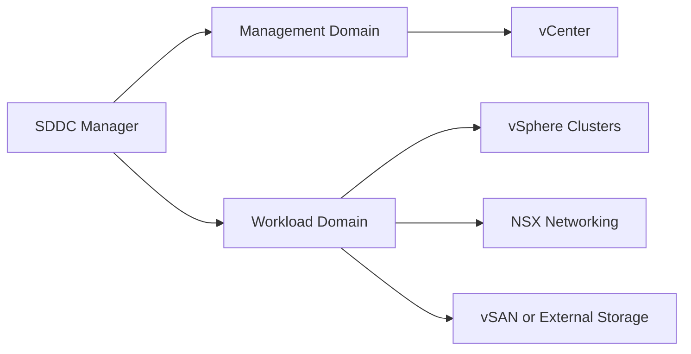

## Overview

VMware Cloud Foundation provides a standardized private cloud operating model across compute, storage, networking, and management services. PTKP uses this page to connect datacenter architecture, lifecycle management, and operational baseline content.

## Key Concepts

- Management domains separate core platform services from workload capacity.
- Lifecycle management coordinates validated software bill updates.
- vSphere, vSAN, NSX, and management components work as one platform boundary.
- Operational ownership must cover compute, network, storage, backup, and monitoring teams.

## Architecture Overview



## Installation

Installation and bring-up should follow the validated design and hardware readiness process for the environment. Confirm network planning, DNS, NTP, certificate strategy, host preparation, and lifecycle prerequisites before deployment.

```bash
nslookup sddc-manager.example.internal
ping -n 4 ntp.example.internal
```

## Configuration

Configuration should document management domain services, workload domain boundaries, network pools, certificate policy, backup responsibilities, and upgrade windows. The platform is easier to operate when lifecycle decisions are visible.

## Best Practices

- Keep the validated software bill and upgrade path documented.
- Treat DNS, NTP, certificates, and backups as critical platform dependencies.
- Separate management and workload operations clearly.
- Record ownership for compute, networking, storage, and lifecycle tasks.

## Common Issues

- Lifecycle operations become risky when component versions are changed outside the platform process.
- Troubleshooting slows down when management domain dependencies are not monitored.
- Network and certificate assumptions can block expansion or recovery work.

## References

- [VMware technical documentation](https://techdocs.broadcom.com/)
- [VMware Cloud Foundation Datacenter](/projects/vmware-cloud-foundation-datacenter/)
- [Secure Platform Operations Baseline](/architecture/secure-platform-operations-baseline/)
